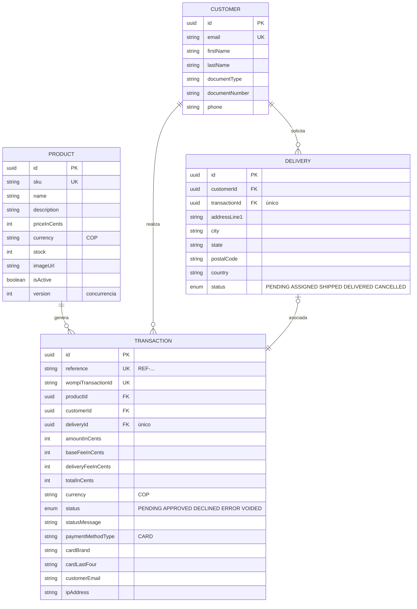

# Checkout Payment App

Aplicación de tienda online con **onboarding de pago con tarjeta de crédito** y entrega a domicilio. El cliente elige un producto, ingresa los datos de su tarjeta y de entrega, revisa el resumen con las tarifas y completa el pago contra una pasarela en **ambiente sandbox (sin dinero real)**. Al finalizar, el stock del producto se actualiza.

> ⚠️ Este repositorio usa **solo ambiente de pruebas/sandbox** de la pasarela de pagos. Ninguna transacción usa dinero real.

---

## Tabla de contenidos

1. [Stack tecnológico](#stack-tecnológico)
2. [Arquitectura](#arquitectura)
3. [Modelo de datos](#modelo-de-datos)
4. [Endpoints de la API](#endpoints-de-la-api)
5. [Flujo del checkout](#flujo-del-checkout)
6. [Ejecución local](#ejecución-local)
7. [Pruebas y cobertura](#pruebas-y-cobertura)
8. [Despliegue en AWS](#despliegue-en-aws)
9. [Seguridad](#seguridad)
10. [Datos de prueba del sandbox](#datos-de-prueba-del-sandbox)

---

## Stack tecnológico

| Capa | Tecnología |
|---|---|
| Frontend | React 18 + Vite + Redux Toolkit (SPA mobile-first) |
| Backend | NestJS + TypeScript (arquitectura hexagonal + Railway Oriented Programming) |
| Base de datos | PostgreSQL 16 + Prisma ORM |
| Pasarela de pagos | API sandbox (staging UAT) de la pasarela |
| Tests | Jest (unit + e2e) con cobertura >80% |
| Infraestructura | AWS CDK (S3 + CloudFront, ECS Fargate, RDS, Secrets Manager) |
| Contenedores | Docker Compose para PostgreSQL local |

---

## Arquitectura

El backend sigue **Arquitectura Hexagonal (Ports & Adapters)**: el dominio y los casos de uso son independientes de los frameworks y de la infraestructura.

```
┌─────────────────────────────┐
│          FRONTEND            │  React + Redux Toolkit (SPA)
│  Producto → Tarjeta+Entrega │  Persistencia de progreso en localStorage
│  → Resumen → Resultado      │
└──────────────┬──────────────┘
               │ HTTP (REST, JSON)
┌──────────────▼──────────────┐
│             API (NestJS)     │
│  ┌────────────────────────┐  │
│  │   API layer            │  │  Controllers + DTOs + validación
│  ├────────────────────────┤  │
│  │   Application          │  │  Use cases con ROP (neverthrow)
│  │   ┌ ports/adapters ──┐ │  │  Orquestación del pago
│  │   │  PaymentGateway  │ │  │
│  │   │  *Repositories   │ │  │
│  │   └──────────────────┘ │  │
│  ├────────────────────────┤  │
│  │   Infrastructure        │  │  Prisma/PostgreSQL + cliente HTTP
│  └────────────────────────┘  │
└──────────────┬──────────────┘
               │
   ┌───────────┴───────────┐
   ▼                       ▼
┌─────────┐            ┌─────────┐
│  Postgres │            │ Pasarela │  Sandbox (tokenización + transacciones)
└─────────┘            └─────────┘
```

**Decisión de diseño clave — flujo de pago resiliente:**
1. El frontend **tokeniza la tarjeta** directo contra la pasarela con la **llave pública** (el PAN nunca llega a nuestro backend).
2. El backend crea la transacción local en `PENDING`, obtiene el token de aceptación, genera la firma de integridad y crea la transacción en la pasarela con la **llave privada**.
3. Sincroniza el estado final (con polling acotado). Si queda `PENDING`, devuelve `requiresSync: true` y el frontend consulta el estado con polling.
4. Al confirmarse `APPROVED`: se actualiza la transacción, se descuenta el stock (concurrentemente, usando una columna `version`) y se asigna la entrega. Todo es **idempotente** (protegido contra retries).
5. Un **webhook** con verificación de firma HMAC sirve como refuerzo para eventos asíncronos.

---

## Modelo de datos

Diseñado en `apps/api/prisma/schema.prisma`.



**Notas de diseño:**
- Los montos se guardan en **centavos** (enteros) para evitar errores de punto flotante.
- `Transaction.status` controla el ciclo de vida y las transiciones solo se permiten desde estados no finales.
- El stock se descuenta de forma atómica: `UPDATE products SET stock = stock - 1, version = version + 1 WHERE id = ? AND stock > 0 AND version = ?` (evita sobreventa).
- `Delivery.transactionId` es único y se asigna solo cuando el pago es `APPROVED`.

---

## Endpoints de la API

Base URL local: `http://localhost:3000/api/v1`
Docs interactivas (Swagger): `http://localhost:3000/api/docs`

| Método | Ruta | Descripción | Respuestas |
|---|---|---|---|
| `GET` | `/products` | Lista productos con su stock | `200` |
| `GET` | `/products/:id` | Detalle de un producto | `200`, `404` |
| `POST` | `/checkout/transactions` | Crea la transacción `PENDING`, procesa el pago con la pasarela y aplica el resultado | `201`, `400`, `409` |
| `GET` | `/checkout/transactions/:reference` | Estado de la transacción (sincroniza con la pasarela si está pendiente) | `200`, `404` |
| `POST` | `/webhooks/payments` | Webhook de eventos de la pasarela (firma HMAC verificada) | `200`, `400` |

**Colección de Postman:** [`postman/checkout-payment.postman_collection.json`](./postman/checkout-payment.postman_collection.json)

### Ejemplo: crear checkout

```http
POST /api/v1/checkout/transactions
Content-Type: application/json

{
  "productId": "5cc58f00-f7f3-455e-8d6a-b2bddbc83299",
  "cardToken": "tok_stagtest_5113_...",
  "customer": {
    "email": "cliente@test.com",
    "firstName": "Juan",
    "lastName": "Perez",
    "documentType": "CC",
    "documentNumber": "1067981234",
    "phone": "3001234567"
  },
  "delivery": {
    "addressLine1": "Calle 123 # 45-67",
    "city": "Bogota",
    "state": "Cundinamarca",
    "postalCode": "110111",
    "country": "CO"
  }
}
```

Respuesta (`201`):

```json
{
  "transaction": {
    "reference": "REF-mswrgni7-E8D58CD5CE",
    "status": "APPROVED",
    "totalInCents": 257900,
    "baseFeeInCents": 3000,
    "deliveryFeeInCents": 5000,
    "...": "..."
  },
  "product": { "stock": 11 },
  "delivery": { "status": "ASSIGNED" },
  "requiresSync": false
}
```

### Validaciones de los endpoints

- DTOs validados con `class-validator` (whitelist + rechazo de campos desconocidos).
- `productId` debe ser UUID válido.
- `customer.email` debe ser correo válido; `documentNumber` solo dígitos (4-20).
- `postalCode` formato `[0-9A-Za-z-]{3,10}`.
- El monto de la transacción lo calcula **el servidor** (nunca se confía en el cliente).
- La referencia es única; los retries del webhook/consulta son idempotentes.

---

## Flujo del checkout

Flujo de 5 pasos exigido por el negocio:

```
1. Página de producto ─► 2. Tarjeta + Entrega (modal) ─► 3. Resumen (backdrop)
     ▲                                                    │
     └──────────────── 5. Producto actualizado ──── 4. Resultado
```

1. **Página de producto:** lista con nombre, descripción, precio y **stock disponible**. Botón **"Pagar con tarjeta"**.
2. **Modal:** datos de la tarjeta (con detección de franquicia VISA/Mastercard y validación Luhn), datos del cliente y datos de entrega. La tarjeta se **tokeniza** contra la pasarela.
3. **Resumen en backdrop:** producto + **tarifa base** (siempre) + **tarifa de envío** = total. Botón **"Pagar"**.
4. **Resultado:** pantalla de procesamiento y estado final (aprobado / rechazado / error) con la referencia de la transacción.
5. **Vuelta al catálogo** con el stock actualizado.

**Resiliencia ante refresco:** el progreso (paso actual, producto, cliente, entrega, tarjeta enmascarada, referencia) se persiste en `localStorage` y se restaura al recargar. Si el pago ya estaba en curso, la app re-consulta el estado por referencia. **Nunca se persisten** el número completo de la tarjeta, el CVC ni el token.

---

## Ejecución local

Requisitos: Node.js ≥ 20, Docker, npm.

```bash
# 1. Levantar PostgreSQL (dos contenedores: desarrollo y pruebas)
docker compose up -d

# 2. Backend
cd apps/api
cp .env.example .env          # editar si hace falta
npm install
npm run prisma:generate
npm run prisma:migrate        # crea el esquema
npm run prisma:seed           # 6 productos de ejemplo
npm run start:dev             # http://localhost:3000/api/v1

# 3. Frontend (en otra terminal)
cd apps/web
cp .env.example .env
npm install
npm run dev                   # http://localhost:5173
```

> El frontend usa el proxy de Vite (`/api` → `http://localhost:3000`) durante el desarrollo.

### Variables de entorno clave (`.env` del backend)

| Variable | Descripción |
|---|---|
| `DATABASE_URL` | URL de PostgreSQL (localhost:5434 = contenedor Docker) |
| `PAYMENT_API_URL` | `https://api-sandbox.co.uat.wompi.dev/v1` (sandbox) |
| `PAYMENT_PUBLIC_KEY` / `PAYMENT_PRIVATE_KEY` | Llaves de la pasarela (sandbox) |
| `PAYMENT_EVENTS_KEY` / `PAYMENT_INTEGRITY_KEY` | Secretos de webhook e integridad |
| `BASE_FEE_CENTS` / `DELIVERY_FEE_CENTS` | Tarifas base y de envío en centavos |

---

## Pruebas y cobertura

### Backend (`apps/api`)

```bash
cd apps/api
npm run test:cov     # unit + e2e con cobertura combinada
```

Resultado de cobertura (Jest):

| Métrica | Cobertura |
|---|---|
| Líneas | **94.19%** |
| Statements | **94.66%** |
| Funciones | **89.47%** |
| Ramas | **78.12%** |

- **66 unit tests** de dominio (transacciones, precios, productos), casos de uso (ROP con todas las ramas: aprobado/declinado/sin stock/errores de pasarela/timeout), adaptador de la pasarela (con axios mockeado), verificación de firmas, validación de entorno y controladores.
- **9 tests e2e** contra una base de datos de prueba real (contenedor `postgres-test`, puerto 5435) con la pasarela mockeada: flujo aprobado (descuenta stock y asigna entrega), declinado (sin tocar stock), sin stock (`409`), validaciones (`400`), consulta de estado y webhook.

### Frontend (`apps/web`)

```bash
cd apps/web
npm run test:cov
```

Resultado de cobertura (Jest):

| Métrica | Cobertura |
|---|---|
| Líneas | **90.04%** |
| Statements | **89.67%** |
| Funciones | **86.89%** |
| Ramas | **82.32%** |

- **80 tests** con React Testing Library y user-event: validación Luhn/detección de franquicia, slices (Redux), tokenización, formularios de cliente/entrega, modal de pago, resumen, resultado, persistencia en `localStorage` y recuperación tras refresco.

---

## Despliegue en AWS

La infraestructura se define como código con **AWS CDK** en `infra/`.

```
infra/
├── bin/checkout-payment.ts        # entry point del app CDK
├── lib/checkout-payment-stack.ts  # VPC, RDS, ECS Fargate, S3+CloudFront
├── cdk.json
└── package.json
```

| Componente | Servicio AWS | Detalle |
|---|---|---|
| Frontend (SPA) | **S3 + CloudFront** | Estático, HTTPS, cabeceras de seguridad, SPA fallback |
| API (NestJS) | **ECS Fargate + ALB** | Imagen Docker multistage, health checks, logs a CloudWatch |
| Base de datos | **RDS PostgreSQL 16** | Instancia `t4g.micro` (free tier), backups 7 días |
| Secretos | **Secrets Manager** | Llaves de la pasarela y credenciales de la BD |

### Pasos de despliegue

```bash
# 1. Requisitos previos: AWS CLI configurado y CDK bootstrapped
cd infra
npm install

# 2. Compilar el frontend (se sube como estático a S3)
cd ../apps/web && npm install && npm run build && cd ../../infra

# 3. Sintetizar y desplegar
npm run synth
npm run deploy
```

Al terminar, CDK imprime la URL del frontend (`https://dxxxxxxxxxxxx.cloudfront.net`). La API queda detrás del ALB con las migraciones de Prisma aplicadas al arrancar el contenedor.

---

## Seguridad

Prácticas alineadas con OWASP:

- **HTTPS** en producción vía CloudFront (redirección obligatoria desde HTTP).
- **Cabeceras de seguridad** en CloudFront: `Content-Security-Policy`, `Strict-Transport-Security`, `X-Content-Type-Options: nosniff`, `X-Frame-Options: DENY`, `Referrer-Policy`, `Permissions-Policy`.
- **El PAN nunca toca nuestro backend**: la tarjeta se tokeniza con la llave pública directamente desde el frontend.
- **Llaves privadas solo en el servidor** (ECS) vía Secrets Manager; nunca en el frontend ni en el repo (`.env` está en `.gitignore`).
- **Rate limiting** global en la API (`@nestjs/throttler`).
- **Firma de integridad** (HMAC-SHA256) en las transacciones y **verificación de firma** (`timingSafeEqual`) en el webhook.
- **Manejo seguro de datos sensibles**: no se persisten número completo, CVC ni token de tarjeta.
- DTOs con *whitelist* y rechazo de campos inesperados.
- Captura de IP de origen para trazabilidad (fraude).

---

## Datos de prueba del sandbox

Ambiente: `https://api-sandbox.co.uat.wompi.dev/v1` (llaves con prefijo `stagtest_`).

| Número de tarjeta | Resultado |
|---|---|
| `4242 4242 4242 4242` | **Aprobada** (`APPROVED`) |
| `4111 1111 1111 1111` | **Declinada** (`DECLINED`) |
| cualquier otra | `ERROR` |

Cualquier fecha de expiración futura y CVC de 3 dígitos son válidos.

---

## Documentación adicional

- [Colección de Postman](./postman/checkout-payment.postman_collection.json)
- Esquema de base de datos: `apps/api/prisma/schema.prisma`
- Migraciones: `apps/api/prisma/migrations/`
- Infraestructura CDK: `infra/`

## Licencia

Uso exclusivo como solución para prueba técnica.
